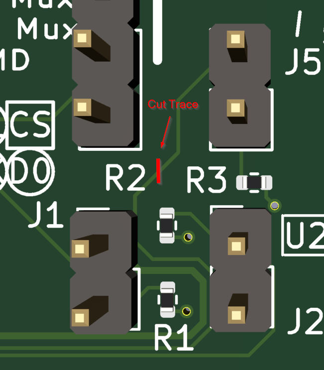
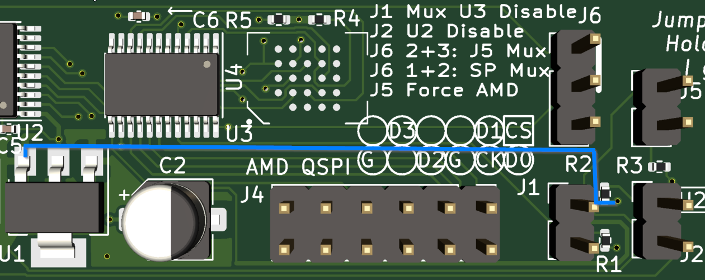
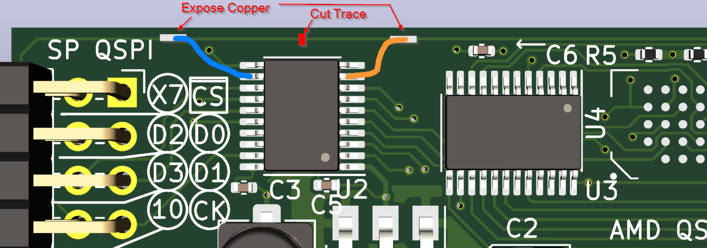
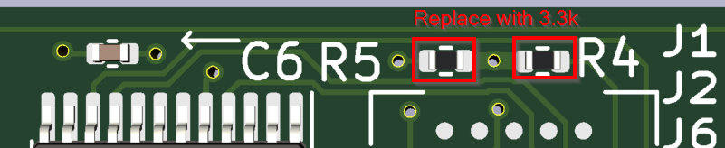
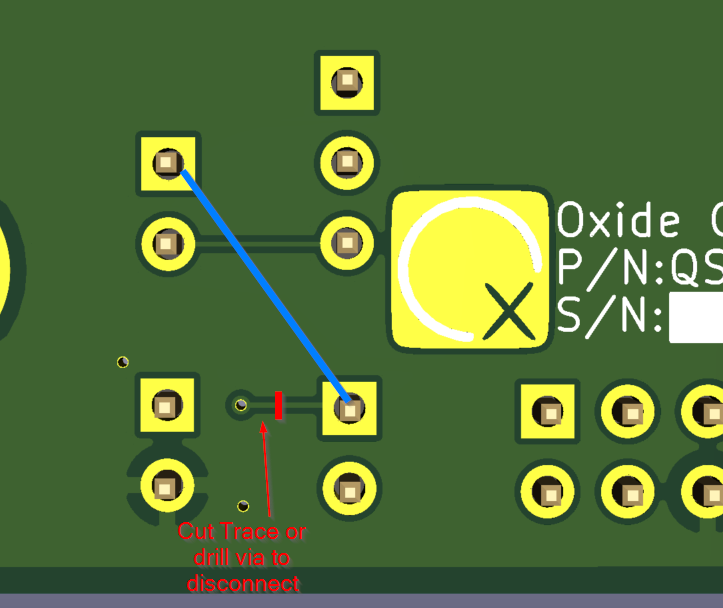
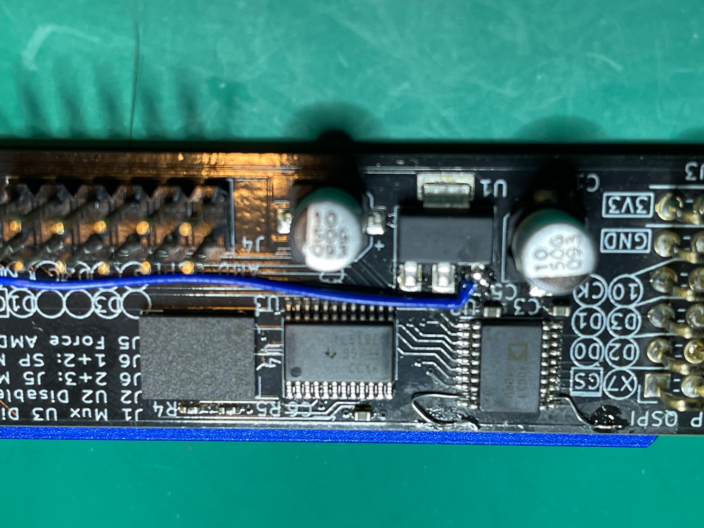
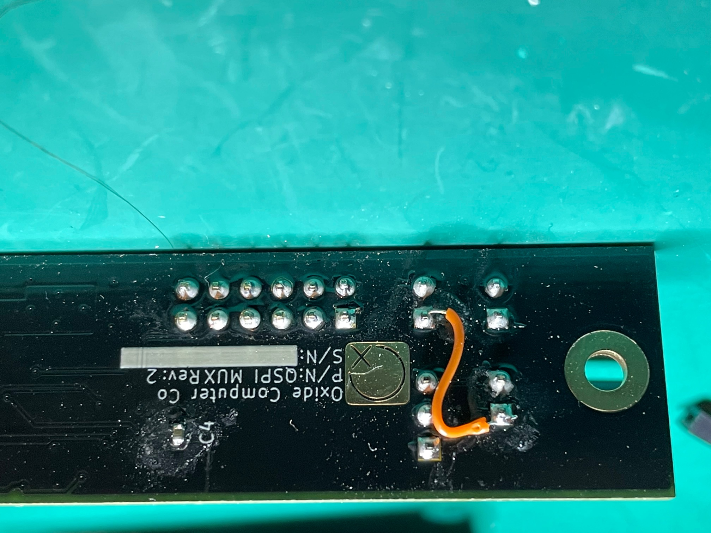

= SPI Mux MCN rev2-E1

== Rationale
A couple of incorrect voltages were identified though testing of the spimux.

. U2 pin10 (enable) should be a 3V3 signal rather than a 1V8 signal
. U3 pins 14 and 24 (mux select) should be a 1V8 signal rather than a 3V3 signal.

Note the rework documented here will use the spare channel on the level translator so that the flash mux select goes through the level translator from the SP.

To fix the first issue, we're going to disconnect R2 from 1V8 and connect to 3V3 so SP_TRANS_EN is pulled up to 3V3.

To fix the second issue, we're going to run the SP signal `SP_QSPI_XTRA10` through the level translator and also disconnect
J5 pin 1 from 3V3 and connect it to 1V8.

Additionally R4 and R5 are too weak to properly drive the bus (with the level translator) when nothing is connected. these will be changed to 3.3k Ohms.

== Material/Tools

Aside from normal lab tools like optical magnification, solder, flux, and tweezers, you'll need:

. some 30ga wire, 

. qty 2 3.3k 0402 resistors (per board)

. exacto knife for scraping/cutting traces.

== Physical Rework steps

To disconnect J5 pin1 from 3V3 and connect it to 1V8 do the following:

. Cut the trace (`3V3`) between the silkscreen of `R2` and `R3`

. Connect the now-disconnected size of R2 to 3V3 with a jumper wire as shown below in the 2nd picture.

. Cut the trace running along the top-side of the board `SP_QSPI_XTRA10` where indicated in red. (first picture)

. Carefully expose the copper of the traces on either side of the cut to allow jumper wires to be soldered to these spots. (Light grey blocks in first picture below)

. Solder a jumper (blue in first picture below) between the exposed trace and pin 12 of U2 (un-used Y8 of level translator)

. Solder a jumper (orange in first picture below) between U2 pin 9 (un-used A8 of level translator) and the remaining exposed trace

. Replace R4 and R5 on the top side of the board with 3.3k resistors.

. On the back side of the board, solder a jumper between J1 pin1 (`1V8`) and J5 pin 1 (see 2nd picture below)

. On the back side of the board, the the trace (`1V8`) between J2 pin1 and the via, or optionally 
carfully drill the the via to disconnect from 1V8

Update the board marking:

- Re-label board as rev2-E1

Final example rework pictures:

== Determinations

Until spi-mux bring-up is complete no cad changes have been initiated.
